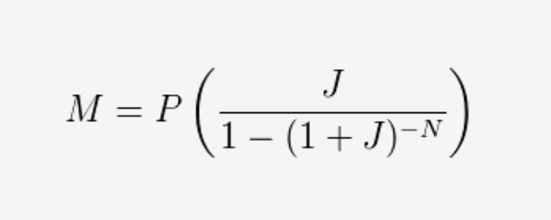

# Mortgage Calculator (PEDAC)

## 1. Problem
Create a program to calculate the monthly mortage payments a user has to make using the **principal** (the amount of money), the **APR** (Annual Percentage Rate), and the **loan duration** (in months).

### 1.1. Input/s
- **The Loan Amount (Principal)**: float
- **The Annual Percentage Rate (APR)**: float
- **Loan duration (in years)**: integer

---
### 1.2. Output/s
- **Monthly Payment**: string

---
### 1.3. Rules/Requirements
#### Explicit Requirements

You'll need three pieces of information:
- The Loan Amount (Principal)
- The Annual Percentage Rate (APR)
- Loan duration (in years)

From the above, you'll need to calculate the following two things:
- monthly interest rate
- loan duration in months

Use the following formula:


`M` = monthly payment
`P` = loan amount
`J` = monthly interest rate
`N` = loan duration in months

**Recommendations**:
- Don't use single letter variables like in the formula above
- Try to print the payment amount as a dollar and cents amount, e.g., `$123.45` or `$371.00`.


#### Implicit Rules
- The user should enter the **NPR** as an integer
  - e.g. `5` for `5%`
  - e.g. `4.17` for `4.17%`
- Calculate the Monthly Interest Rate
  - by dividing the `APR` by `12` months
- **Loan Duration** will be represented in **months**
  - e.g. `360` for `360 months`
- The user must enter a [Loan Amount] greater than 0
- The user must enter an [APR] greater than or equal to 0
- The user must enter a loan duration greater than 0 months
- The user must enter a loan duration as an positive integer
- The monthly payment result must be presented as a string
- All user input data must be validated
---

#### 1.4. Edge Cases
- Support no-interest loans?
  - The user must enter an [APR] greater than or equal to 0
- Support loans that aren't for integer number of years?
  - The user must enter a loan duration as an positive integer
  - e.g. `300` is valid
  - e.g. `200.5` is invalid
- The user must enter a loan duration greater than 0 months
  - e.g. `1` is valid
  - e.g. `30` is valid
  - e.g. `0` is invalid
  - e.g. `-4` is invalid

#### 1.5. Constraints
- What is the maximum amount of months you can get a loan for?
  - MAX: 60 years, or 720 months
  - MIN: 1 year, 12 months

#### 1.6. Clarifying questions
- How to handle input validation?
- How to handle errors and invalid data?
- How to right justify the morgage summary data displayed to the user?
- How to handle 0 APR inputs?

#### 1.7. Problem Domain
**Problem Domain**: Financial Accounting, Mortgages/Loans.

##### What is a `loan`?
- A loan is a contract between a borrower, and a lender in which the borrower receives an amount of money (a.k.a. **principal**) that are obligated to pay back in the future.

##### What is a `mortgage`?
- A mortgage is a type of loan. A mortgage loan is used to buy a home or to borrow money against the value of a home you already own.

##### What is the `Principal`?
- Refers to the "loan amount", or the amount of money the user is borrowing and is obligated to pay back in the future.

##### What is `Annual Percentage Rate (APR)`?
- Is a broader measure of the cost of borrowing money than the interest rate.
- The APR reflects the interest rate, any points, mortgage broker fees, and other charges that you pay to get the loan.
- APR is usually higher than your interest rate.
- APR represents the costs associated with taking out a mortgage. These costs include:
  - **The interest rate**: The cost you will pay each year to borrow the money, expressed as a percentage rate. It does not reflect the fees or any other charges you may have to pay for the loan.
  - **Points (discount points)**: Lower your interest rate in exchange paying for an upfront fee.
  - **Fees**: Brokerage and processing fees.
  - **Other charges**: Other charges associated that you pay to get the mortgage/loan.

##### What does `Mortgage Duration` refer to?
- The amount of time (in months) it will be required to pay back the mortage.

##### Resources
- [APR](https://www.consumerfinance.gov/ask-cfpb/what-is-the-difference-between-a-mortgage-interest-rate-and-an-apr-en-135/#:~:text=An%20annual%20percentage%20rate%20(APR)%20is%20a%20broader%20measure%20of,higher%20than%20your%20interest%20rate.)
- [Mortgage](https://www.consumerfinance.gov/ask-cfpb/what-is-a-mortgage-en-99/#:~:text=A%20mortgage%20is%20an%20agreement,a%20home%20you%20already%20own.)
- [Loan Calculator](https://www.calculator.net/loan-calculator.html)
- [Mortgage Payment Calculator](https://www.bankrate.com/calculators/mortgages/mortgage-payment-calculator.aspx)

---

#### 1.8. Mental Model
Prompt the user to enter 3 pieces of data: 1) The Loan Amount (Principal), 2) The Annual Percentage Rate (APR) and 3) Loan duration (in months). Then, using the given data calculate the monthly interest rate by dividing the APR by 12 months, and the loan duration in months by multiplying the loan duration in years by 12. Then, calculate the monthly mortgage/loan payment by using the provided formula. Finally display the monthly mortgage payment as a string message.

##### Bonus Feature:
- Calculate the total mortgage cost

---

#### 1.9. Diagram

---

#### 1.10. Program Interface
```sh
------------------------------------
Required Mortgage Information
------------------------------------
Please enter your loan amount (in dollars)
> 160,000.00

Please enter the Loan Duration (in years)
e.g. 10 years (NO decimal places)
> 360

Please enter the Annual Percentage Rate
(e.g enter 3 to indicate 3%)
> 4.0


------------------------------------
House Mortage Summary
------------------------------------
Principal:                  $160,000
Mortage duration:           360 months (30 years)
Annual Percentage Rate:     4%
Monthly Percentage Rate:    0.0033%
Total Mortgage Cost:        $274,989.60


Monthly Mortage Payment:    $763.86
```


---


## 2. Examples/Test Cases
### Case 1
loan amount (in dollars): 160,000
Loan Duration (in years): 30
Annual Percentage Rate (APR): 4
Monthly payment: $763.86

### Case 2
loan amount (in dollars): 240,000
Loan Duration (in years): 30
Annual Percentage Rate (APR): 11
Monthly payment: $3000.85

### Case 3
loan amount (in dollars): 50,000
Loan Duration (in years): 12
Annual Percentage Rate (APR): 11
Monthly payment: 626.78


## 3. Data Structure
An object will be use to represent input data

## 4. Algorithm
Outline of the steps that will be needed to convert input to output

#### Informal Pseudocode
Prompt the user to enter the `loan amount (principal)`
Prompt the user to enter the `loan duration (in years)`
Prompt the user to enter the `Annual Percentage Rate (APR)`

Calculate the `monthly interest rate`
Calculate the `loan duration in months`
Calculate the `loan monthly payments` using `let m = p * (j / (1 - Math.pow((1 + j), (-n))));`

Display a summary of the user's loan data:
- Principal
- Mortage duration (years and months)
- Annual Percentage Rate
- Monthly Percentage Rate
- Total Mortgage Cost

Display the `monthly loan payment` to the console


## 5. Code
#### Algorithm Code Implementation
- divide code into small functions
- implement functions in `mortgageCalculator`

## TODOS
Current problem with the program
- [] The program allows for empty input for the `loanAmount`, `duration` and `apr`.
- [] The program allows for `negative inputs`
- [] `isInvalid()` function does not work as intended
    - `typeof data === 'undefined' and data > 0` does not make any sense
- [] change the name of the parameter `variable` on line `103` (e.g. dataType or inputType)
